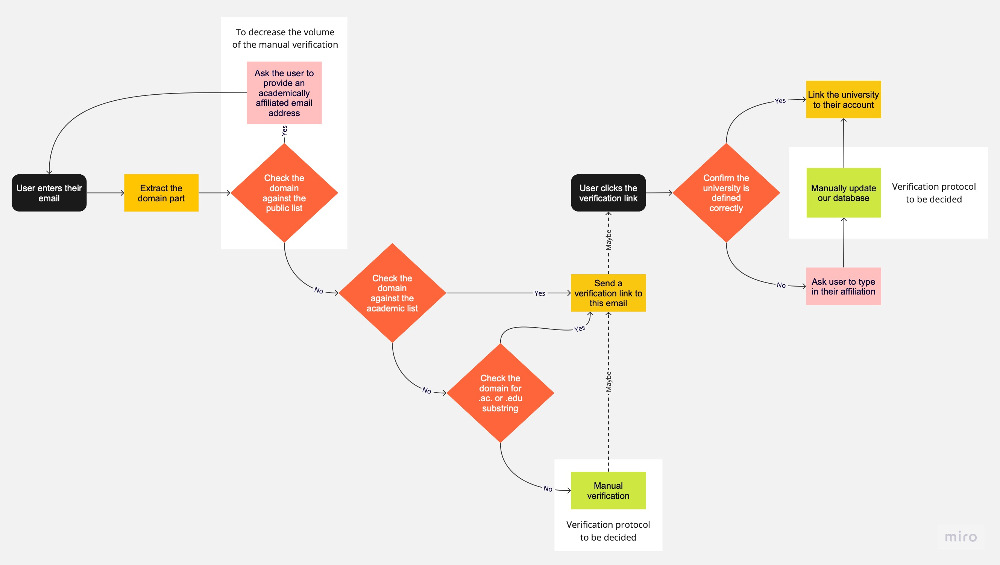
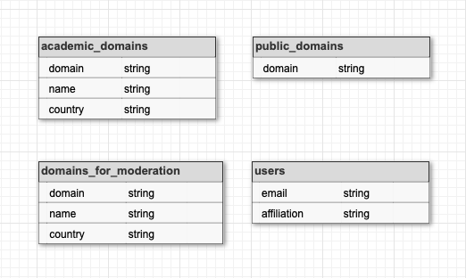

# Academic Email Checker

This repository contains a Python script that checks whether an email address is associated with an academic institution. The script prompts users to enter an email address, and it verifies the domain against a list of known academic and public domains.

To simplify the prototype, CSV files are used instead of sql-tables, but the description of the interaction with the database implies that sql-tables will be used in production.

## Algorithm description

### Part I: Email Verification
1. < Start: User enters their email address >.
2. Extract the domain part of the email address (e.g., "university.edu" from "johndoe@university.edu") and proceed to step 3.
3. Compare the email domain against the list of public domains. If a match is found, request the user to provide an email address affiliated with an academic institution. Otherwise, move to step 4. `This check should reduce the number of addresses fallen into the manual check.`
4. Compare the email domain against the list of known academic domains. If a match is found, send a verification link to the provided email address to complete the registration process. If not, proceed to step 5.
5. Examine the email domain for the “.ac.”, “.edu.” substrings or ending for the “.edu”. If either is present, it is highly likely an academic email address, so send the verification link. If not, continue to step 6.
6. If the domain does not appear in either the public or academic domain lists, flag the email for manual verification. `This step accommodates unusual cases and minimizes false negatives.`

### Part II: Affiliation Confirmation
1. < Start: User clicks on the verification link >.
2. Retrieve the corresponding affiliation and ask the user if the recorded information for their domain is accurate. If so, link the affiliation to their account. If not, proceed to step 3.
3. Prompt the user to provide the correct affiliation name and country. Flag it for the manual verification.
4. Manually update the list of academic domains. As more users undergo manual verification, the accuracy of the algorithm will enhance over time.

## Database design

1. Create an **academic_domains** table to store information about universities and their email domains:
   - `domain`: The domain used for the university's email addresses (e.g., asu.edu, lse.ac.uk, etc.).
   - `name`: The full name of the university.
   - `country`: The country where the university is located.

2. Create a **public_domains** table to store information about public email providers:
   - `domain`: The domain of the public email provider (e.g., gmail.com, hotmail.com, etc.).

3. Create a **domains_for_moderation** table to store domains that require manual verification:
   - `domain`: The domain associated with the university's email addresses (e.g., asu.edu, lse.ac.uk, etc.).
   - `name`: The full name of the university.
   - `country`: The country where the university is located.
4. Create a **users** table to store user information:
   - `email`: The email address of the user.
   - `affiliation`: The full name of the user's affiliated university.
   - `<…>`: any other info necessary.

To populate the **academic_domains** table, might use the university-domains-list repository (https://github.com/Hipo/university-domains-list) as a starting point.

To populate the **public_domains** table, might use a list of common public email domains. (https://gist.github.com/tbrianjones/5992856) used as an example for the prototype.

## Requirements

- Python 3.x
- CSV files containing academic and public email domains (comes with the data folder)

## Run the script

    python email_checker.py -e <valid email address>

Ensure that the `academic_domains.csv` and `public_domains.csv` files are downloaded and located in the `data` folder.

Update these files with the appropriate domain data if needed.

The script will prompt you to enter an email address. Follow the instructions provided by the script.

## Test cases
    test_cases = [
        'someone@univie.ac.at',
        'someone@gmail.com',
        'someone@ucsd.edu',
        'someone@ens.psl.eu',
        'someone@ax.sub.education',
        'someone@isu.edu',
        'someone@psy.fsu.edu',
        'someone@st.swps.edu.pl',
        'someone@hortonworks.ace',
        'someone@uni-bonn.de',
        'someone@twu.edu',
        'someone@academy.acer.com',
        'someone@mail.huji.ac.il',
        'someone@soton.ac.uk',
        'someone@edutain.me',
    ]
